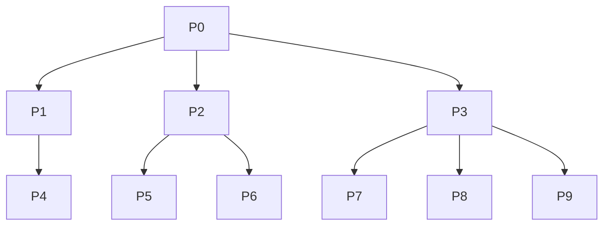

# Operating Systems — Processes & Threads in C

[](https://github.com/matinapap/Operating-Systems/actions/workflows/build.yml)


[](LICENSE)

Two C programs that cover core operating systems topics: **building a process tree with `fork()`/`exec()`** and **coordinating POSIX threads with semaphores and mutexes**.

> Developed for the optional Operating Systems assignment (2024–25), Department of Informatics, University of Piraeus.

---

## Table of Contents

- [Project Structure](#project-structure)
- [Part 1 — Process Tree](#part-1--process-tree-with-fork-and-exec)
- [Part 2 — Thread Synchronization](#part-2--thread-synchronization-with-pthreads-and-semaphores)
- [Getting Started](#getting-started)
- [Concepts Demonstrated](#concepts-demonstrated)
- [License](#license)

---

## Project Structure

```
.
├── src/
│   ├── process_tree.c      # Part 1: process hierarchy with fork/wait/exec
│   └── threads_posix.c     # Part 2: pthreads + semaphores + mutexes
├── .github/workflows/
│   └── build.yml           # CI: build & run on Ubuntu
├── Makefile
├── LICENSE
└── README.md
```

---

## Part 1 — Process Tree with `fork()` and `exec()`

[`src/process_tree.c`](src/process_tree.c) creates a tree of **10 processes**. Each one prints its name, PID and parent PID.



### Synchronization rules

| Process | Constraint |
|---------|------------|
| **P2**  | Waits for **P6** (`waitpid`) before printing its own info, then reaps P5. |
| **P3**  | Waits for **P9** and **P7** before printing, then reaps the remaining child. |
| **P0**  | Waits for **P1**, prints its info, then replaces itself with `cat` via `execlp()` to print its own source code. |

### Example output

PIDs vary between runs, and the order across branches depends on the scheduler.

```
P1: PID=14923, PPID=14921
P4: PID=14925, PPID=14923
P5: PID=14927, PPID=14924
P6: PID=14928, PPID=14924
P7: PID=14929, PPID=14926
P2: PID=14924, PPID=14921
P8: PID=14930, PPID=14926
P9: PID=14931, PPID=14926
P3: PID=14926, PPID=14921
P0: PID=14921, PPID=14800
#include <stdio.h>
...
```

---

## Part 2 — Thread Synchronization with Pthreads and Semaphores

[`src/threads_posix.c`](src/threads_posix.c) starts **6 POSIX threads** split into two groups:

| Group | Threads | Function |
|-------|---------|----------|
| 1 | 0, 1, 2 | `thread_func_1` |
| 2 | 3, 4, 5 | `thread_func_2` |

### How it works

- **Ordering with semaphores:** six semaphores `s[0..5]` form a ring. Only `s[0]` starts unlocked, and each thread signals the next one. Each thread waits on its semaphore once, so its start-up lines (`ID = n`, `A.n`) print strictly in order **0 → 1 → 2 → 3 → 4 → 5**. The later `B`/`C` phases run concurrently.
- **Mutual exclusion with mutexes:** three mutexes (`m0`, `m1`, `m2`) protect three shared counters (`counter`, `counter1`, `counter2`) so increments don't race.
- **Correctness check:** each counter is incremented exactly **60,000,000** times across all threads. `main()` joins every thread and prints the final values.

### Example output

```
ID = 0
A.0
ID = 1
A.1
...
ID = 5
A.5
B.2
...
Final counter: 60000000
Final counter1: 60000000
Final counter2: 60000000
```

---

## Getting Started

### Prerequisites

- A POSIX system. **Linux is recommended** (WSL works too).
- `gcc` or `clang`, and `make`

> **macOS note:** macOS does not implement unnamed POSIX semaphores (`sem_init` fails with `ENOSYS`). `threads_posix` will compile there, but its thread ordering only works on Linux. `process_tree` runs fine on macOS.

### Build & run

```bash
git clone https://github.com/matinapap/Operating-Systems.git
cd Operating-Systems

make                    # builds both programs into bin/
make run-process-tree   # Part 1
make run-threads        # Part 2
make clean              # removes bin/
```

To compile by hand:

```bash
gcc -Wall -Wextra -o bin/process_tree src/process_tree.c
gcc -Wall -Wextra -pthread -o bin/threads_posix src/threads_posix.c
```

> Run `process_tree` from the repository root: the final `execlp("cat", ...)` call opens the source file by its relative path.

---

## Concepts Demonstrated

| Area | APIs |
|------|------|
| Process creation & replacement | `fork()`, `execlp()` |
| Process synchronization | `wait()`, `waitpid()` |
| Process identity | `getpid()`, `getppid()` |
| Threads | `pthread_create()`, `pthread_join()` |
| Mutual exclusion | `pthread_mutex_init/lock/unlock/destroy()` |
| Ordering / signaling | `sem_init()`, `sem_wait()`, `sem_post()`, `sem_destroy()` |

---

## License

Distributed under the **GNU General Public License v3.0**. See [`LICENSE`](LICENSE) for details.

## Author

**Matina Papadakou** · [@matinapap](https://github.com/matinapap)
